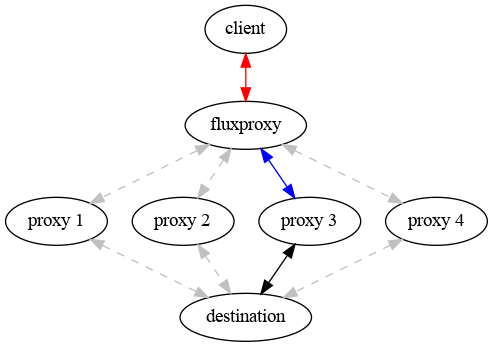

# HTTP Getaway Part 2: HTTP proxy intro

> Martin Czygan, 2020-09-17, 19:00 CEST, Short talk at Leipzig Gophers #12
> (online), https://golangleipzig.space

Background: I recently had the chance to learn more about proxy servers, as I
am looking into proxies for archiving purposes (distributed crawling/ip
rotation and web archiving).

Proxy servers are ubiquitous, and they embody the rule:

> All problems in computer science can be solved by another level of indirection.

If you have a networking problem, a proxy might be a solution. Beside that,
proxies can be fun and useful.

# A tech book from 22 years ago


I got a copy (from [betterworldbooks.com](https://www.betterworldbooks.com/)).

# Outline

* Proxy types (forward, reverse, ...)
* How does a client use a proxy?
* What standard library support is there?
* Writing a proxy from scratch: HTTP, HTTPS.

# Proxy Types


* forward
* reverse

## Forward

* implicit and explicit
* implicit: corporate FW; SSL decrypt
* explicit: need to set on client
* use cases: mitm, archiving, caching, security, ip rotation, and many more

## Reverse

* handle incoming requests, load balancing, "HAvailability", mu-service
  configuration and routing, rate limiting, a/b and canary testing, ...

In this talk, we focus on forward proxies only.

# How does a client use a proxy?

* HTTP_PROXY, HTTPS_PROXY, NO_PROXY environment variables, [are these
  standard](https://superuser.com/questions/944958/are-http-proxy-https-proxy-and-no-proxy-environment-variables-standard)?
probably not.

Where is the code to handle the environment variables?

The `http.DefaultTransport` sets the `Proxy` field:

```go
var DefaultTransport RoundTripper = &Transport{
    Proxy: ProxyFromEnvironment,
    ...
```

And if nothing else is set, the default transport is used be the default client
(also: "make the zero value useful"):

```go
// DefaultClient is the default Client and is used by Get, Head, and Post.
var DefaultClient = &Client{}

...

func (c *Client) transport() RoundTripper {
    if c.Transport != nil {
        return c.Transport
    }
    return DefaultTransport
}
```

Which then is used for the verb functions:

```go
func Get(url string) (resp *Response, err error) {
    return DefaultClient.Get(url)
}
```

The `Proxy` field is a function type:

```go
func(*Request) (*url.URL, error)
```

which is quite nice. If an error is returned, the request will fail
([x/proxyerr.go](x/proxyerr.go)).

The implementation looks up the proxy from environment variables only once
(since it seems this lookup can be expensive on Windows: *This mitigates
expensive lookups on some platforms (e.g. Windows)*.

Here, the standard library code branches out to:

* [x/net/http/httpproxy](https://godoc.org/golang.org/x/net/http/httpproxy)

> Package httpproxy provides support for HTTP proxy determination based on
> environment variables, as provided by net/http's ProxyFromEnvironment
> function.

Fun fact, there seemingly was a CGI (catchy name) CVE in 2016 -
https://httpoxy.org/ - CGI puts the Proxy header from an incoming request into
HTTP_PROXY, there you go. (https://github.com/golang/go/issues/16405).

# Customizing http.Transport Proxy

There are two functions in the standard library:

* `http.ProxyFromEnvironment` (default)
* `http.ProxyURL` - uses a fixed URL

# How to write a basic proxy

There are a myriad of implementations and libraries available:

* [https://github.com/elazarl/goproxy](https://github.com/elazarl/goproxy)
* [https://github.com/telanflow/mps](https://github.com/telanflow/mps)
* [https://github.com/smartystreets/cproxy](https://github.com/smartystreets/cproxy)
* ...

As illustration, we use an "ip rotation proxy" that routes requests to a set of
other proxies, e.g. in a round robin style.



## The easy part &#x1F535;

Thanks to the flexible Proxy function type, we can supply our own proxy function.

Sketch:

```go
type ProxyRotate struct {
    Hosts []*url.URL
}

func (p *ProxyRotate) Cycle(r *http.Request) (*url.URL, error) {
    if len(p.Hosts) == 0 {
        return nil, nil
    }
    i := p.i % int64(len(p.Hosts))
    p.i++
    return p.Hosts[i], nil
}
```

We can set this in transport and be done with it.

```go
...
pr := ProxyRotate{Hosts: ...}
tr := &http.Transport{Proxy: pr.Cycle}
```

## Skeleton &#x1F534;

We want a HTTP handler and we want to handle incoming requests.

* HTTP requests are accepted, a RoundTripper in the proxy fetches the resource on behalf of the client and copies headers and body into the client response.
* For HTTPS, we cannot do this - as we require end-to-end encryption.

Snippet for HTTP:

```go
    copyHeader(resp.Header, w.Header(), true) // For now just add all headers.
    w.WriteHeader(resp.StatusCode)            // Need to pass status code.
    n, err := io.Copy(w, resp.Body)           // Copy body.
```

## HTTPS handling

Following scenario:

* client has an HTTP and HTTPS proxy configured, which listens on an HTTP port
* when the client requests a HTTPS site, it sends a HTTP
  [CONNECT](https://developer.mozilla.org/en-US/docs/Web/HTTP/Methods/CONNECT)
to the server in order to request a tunnel
([RFC7231 4.3.6](https://tools.ietf.org/html/rfc7231#section-4.3.6)).

This tunnel is technically not restricted to HTTPS, but most often is - also for security reasons.

```
CONNECT www.google.com HTTP/1.1
Host: www.google.com
Proxy-Connection: Keep-Alive
```

The `Proxy-Connection` header is somewhat obsolete.

> [Why does curl send a Proxy-Connection header, even though the RFC seems to discourage it?](https://stackoverflow.com/questions/62722430/why-does-curl-send-a-proxy-connection-header-even-though-the-rfc-seems-to-disco)

## Hijack

* An `http.Hijacker` allows to access an underlying connection, e.g. from a ResponseWriter.

```go
func (h *Handler) handleHTTPS(w http.ResponseWriter, r *http.Request) {
    hj, ok := w.(http.Hijacker)
    ...
    conn, _, err := hj.Hijack()
    ...
```

## Proxy Conn

The proxy needs to establish a connection to the exit node.

```go
pconn, err := net.DialTimeout("tcp", proxyURL.Host, 3*time.Second)
```

Then, another CONNECT needs to establish a link to the exit proxy. The first conversation is HTTP.

```go
fmt.Fprintf(pconn, "CONNECT %s HTTP/1.1\r\n", r.URL.Host)
fmt.Fprintf(pconn, "Host: %s\r\n", r.URL.Host)
fmt.Fprintf(pconn, "User-Agent: Mozilla/5.0 (compatible; MSIE 9.0; Windows NT 6.1; Trident/5.0)\r\n")
fmt.Fprintf(pconn, "Proxy-Connection: Keep-Alive\r\n")
fmt.Fprintf(pconn, "\r\n")
```

## The network is reliable

Many things can go wrong and during testing I used a number of broken or
restriced proxy servers.

The main idea is that after CONNECT, the proxy will come back with an HTTP
status code. Sometimes it does not, or if will not be a 200 OK. We can peek
into the response stream (once the conn is established):

```go
var buf = make([]byte, 12)
n, err := pconn.Read(buf)
...
```

The response to a CONNECT does not contain any body.

> (Successful) responses to a CONNECT request method (Section 4.3.6 of
> [RFC7231]) switch to tunnel mode instead of having a message body.

> Any 2xx (Successful) response to a CONNECT request implies that the
> connection will become a tunnel immediately after the empty line that
> concludes the header fields.  A client MUST ignore any Content-Length or
> Transfer-Encoding header fields received in such a message.

## Wiring up

The tunneling can be implemented by letting two goroutines copy bytes from
upstream to downstream and vice versa.

```go
go copyClose(pconn, conn)
go copyClose(conn, pconn)
```

We want to only half-close a connection, when done. There is no standard
library interface for that, but easy enough to write.

```go
// CloseWriter implements CloseWrite, as implemented by e.g. net.TCPConn.
type CloseWriter interface {
    CloseWrite() error
}

// CloseReader implements CloseRead, as implements by e.g. net.TCPConn.
type CloseReader interface {
    CloseRead() error
}
```

## Mighty io.Copy

Cautious implementation of `copyClose`

```go
func copyClose(dst io.WriteCloser, src io.ReadCloser) (n int64, err error) {
    var serr, derr error
    n, err = io.Copy(dst, src)
    if v, ok := src.(CloseReader); ok {
        serr = v.CloseRead()
    } else {
        serr = src.Close()
    }
    if v, ok := dst.(CloseWriter); ok {
        derr = v.CloseWrite()
    } else {
        derr = dst.Close()
    }
    if err == nil && serr == nil && derr == nil {
        return n, nil
    }
    return n, fmt.Errorf("copyClose failed: copy: %v, s: %v, d: %v", err, serr, derr)
}
```

## Wrap up

* proxy unpolished, not open source (yet), but works

Lots of TODOs:

* need to add context and timeout to a complete flow
* optimized proxy selection


# Resources

* https://github.com/creack/goproxy
* https://github.com/jamesmoriarty/goforward
* https://github.com/smartystreets/cproxy
* https://github.com/davidfstr/nanoproxy
